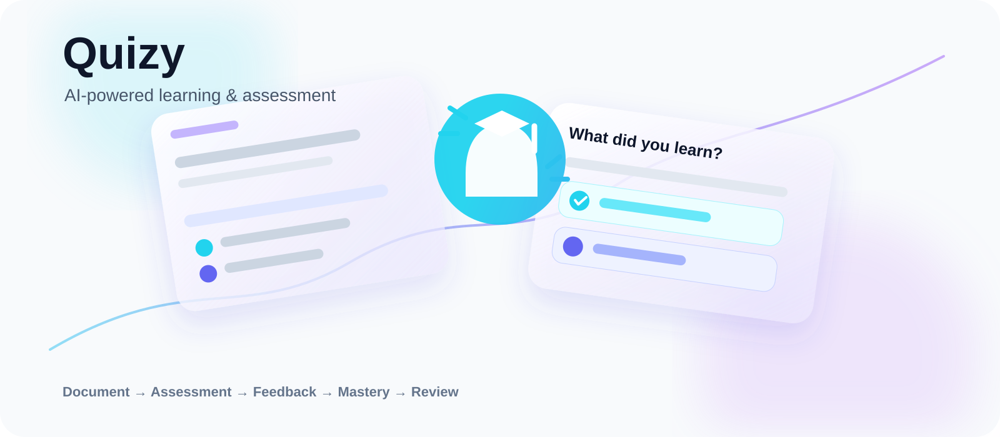

<p align="center">
  
</p>

<p align="center">
  <strong>AI-powered learning & assessment platform</strong>
</p>

<p align="center">
  Turn study material into quizzes, feedback, mastery, and review — with a source-faithful path for existing question banks.
</p>

<p align="center">
  <a href="https://quizkco.pages.dev/">Live Demo</a> ·
  <a href="docs/ARCHITECTURE.md">Architecture</a> ·
  <a href="docs/ENGINEERING_DECISIONS.md">Engineering Decisions</a> ·
  <a href="docs/SECURITY.md">Security</a> ·
  <a href="CHANGELOG.md">Changelog</a>
</p>

<p align="center">
  
  
  
  
  
  
  
</p>

## Product Overview

Most study material is static. Quizy turns it into an active-recall workflow:

```text
Document → Extraction → Assessment → Feedback → Mastery → Review
```

| Workflow | Purpose |
| --- | --- |
| **AI Quiz Generation** | Create new practice questions from study material. |
| **Exact Source** | Import existing questions while preserving source wording, choices, provenance, and available media. |

## Product Capabilities

- PDF, DOCX, and TXT ingestion with page-aware extraction and selective OCR fallback.
- Exact Source mode with source and canonical question hashes for provenance and integrity checks.
- Question Bank with search, filtering, saving, review, and bulk selection.
- Attempt tracking, incorrect-answer review, and mastery-oriented progress.
- Spaced Review workflows for targeted practice.
- AI Tutor for post-answer explanations and assistance.
- RTL-first Arabic UI with accessibility-conscious interaction and motion.
- Responsive application deployed on Cloudflare Workers.

## Engineering Highlights

### Probabilistic AI behind deterministic boundaries

Model output is treated as untrusted input. Responses are schema-validated before persistence or rendering, and uncertain extraction is surfaced for review rather than silently invented.

### Source fidelity as a first-class invariant

Exact Source is isolated from generated-question logic. Raw source data remains distinct from normalized and rendered representations so authoritative material can retain provenance without accidental rewriting.

### Server-first trust boundary

AI and database credentials remain server-side. Browser code communicates with privileged services through server functions rather than importing server-only integrations.

### Split persistence model

```text
Neon PostgreSQL  → relational application state
Cloudflare R2    → uploaded documents + media
```

The database stores structured state and references; object storage handles binary content independently.

## Architecture

```text
┌──────────────────────────────┐
│           Browser            │
│ React 19 + TanStack Router  │
│ document parsing / UI state  │
└──────────────┬───────────────┘
               │ HTTP / SSR
               ▼
┌──────────────────────────────┐
│       Cloudflare Worker      │
│ TanStack Start + Nitro       │
│ Server Functions             │
│ AI provider abstraction      │
│ Learning / quiz services     │
└──────────┬───────────┬───────┘
           │           │
           ▼           ▼
┌────────────────┐  ┌────────────────┐
│ Neon PostgreSQL│  │ Cloudflare R2  │
│ relational     │  │ objects/media  │
└────────────────┘  └────────────────┘
```

See [`docs/ARCHITECTURE.md`](docs/ARCHITECTURE.md) for the runtime model and trust boundaries.

## Tech Stack

| Layer | Technology |
| --- | --- |
| UI | React 19, TypeScript, Tailwind CSS |
| Routing / SSR | TanStack Router, TanStack Start |
| Build / Runtime | Vite, Nitro, Cloudflare Workers |
| Data | Neon PostgreSQL |
| Object Storage | Cloudflare R2 |
| AI | OpenAI-compatible provider abstraction |
| Validation | Zod |
| Documents | pdfjs-dist, Mammoth, OCR fallback |
| Testing | Node test runner + TypeScript |

## Repository Structure

```text
src/                 # application source
├── routes/          # application routes
├── components/      # reusable UI components
└── lib/             # domain utilities, AI, documents, persistence, learning

tests/               # automated tests
evals/               # model evaluation tooling
docs/                # architecture, decisions, security
assets/              # repository presentation artwork
.github/             # CI, security, contribution and issue workflow
migrations/          # database schema/migrations
public/              # static web assets
```

## Quality Gates

Pull requests and pushes to `main` run the repository quality gate:

```text
Install → Typecheck → Lint → Format Check → Tests → Production Build
```

Run the same validation locally:

```bash
npm run validate
```

Individual checks are also available:

```bash
npm run typecheck
npm run lint
npm run format:check
npm test
npm run build
```

Security automation additionally includes CodeQL analysis and dependency review for pull requests.

## Development

### Requirements

- Node.js 20+
- npm

### Install

```bash
npm install
```

### Environment

```bash
cp .env.example .env
```

Configure the required server-side environment variables locally. Never commit real credentials.

### Run

```bash
npm run dev
```

The development server is available at `http://localhost:5173`.

## Security

Quizy treats browser input, uploaded documents, and AI output as untrusted data.

- AI and database credentials are server-side only.
- `.env` and deployment secrets are excluded from Git.
- Imported content is not rendered through `dangerouslySetInnerHTML`.
- AI responses are schema-validated before entering trusted application state.
- Exact Source preserves provenance instead of silently rewriting authoritative content.

See [`docs/SECURITY.md`](docs/SECURITY.md) for the security model.

## Exact Source Guarantees

1. **No silent invention** — missing or uncertain information is marked for review.
2. **No silent rewriting** — authoritative source content remains separate from generated content.
3. **No silent loss** — large documents are processed with progress tracking.
4. **No regeneration** — imported exact questions do not enter the AI generation path.

## Engineering Decisions

Key architectural choices are documented explicitly, including persistence, object storage, AI validation, trust boundaries, deployment, and selective OCR. See [`docs/ENGINEERING_DECISIONS.md`](docs/ENGINEERING_DECISIONS.md).

## Contributing

See [`CONTRIBUTING.md`](CONTRIBUTING.md) for development and pull-request conventions.

## License

MIT — see [`LICENSE`](LICENSE).

## Changelog

See [`CHANGELOG.md`](CHANGELOG.md) for notable project changes.

## Live Demo

**Production:** https://quizkco.pages.dev/

## Project Status

Quizy is actively developed and deployed on Cloudflare infrastructure. Repository documentation is kept aligned with implemented architecture and avoids claiming unavailable functionality.
